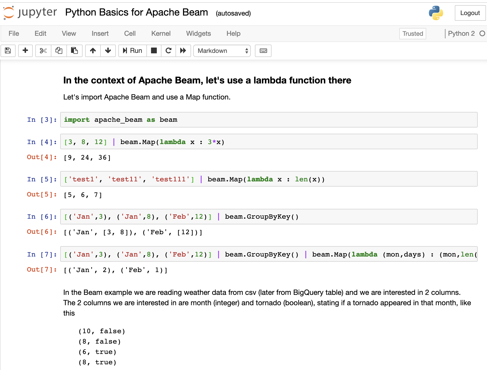
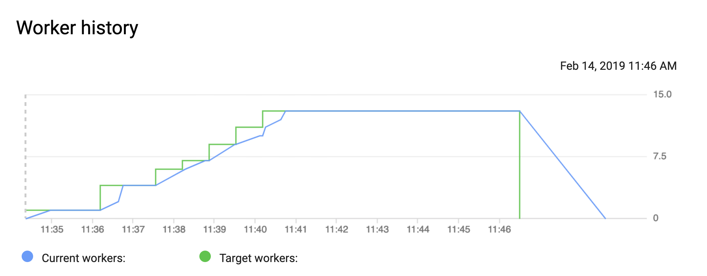

# Apache Beam from Zero
If new to Apache Beam and also new to Python, getting started can be hard. A new SDK plus non-trivial concepts of streaming can be daunting at first. It was daunting for myself so I created this step by step guide starting at (almost) zero. It stops where other tutorials pick up. This is to get you started if other code examples left you stranded in the cold. We start with processing local files and running beam locally to running Beam on Dataflow on GB of weather data. I will start with batch processing and then move to streaming examples. 

If Beam is new to you, I urge you to stop here and first read through the Apache Beam Programming Guide:
https://beam.apache.org/documentation/programming-guide/


## Setup
With a Mac, follow the steps described below, otherwise have a look here:
https://beam.apache.org/get-started/quickstart-py/

**Unix/Mac setup:**
```
mkdir tornadoes
cd tornadoes
pip install --user --upgrade pip
pip install --user --upgrade virtualenv
virtualenv beamzero --python=python2.7
source beamzero/bin/activate # activate your env
cd beamzero
pip install apache-beam[gcp]
git clone https://github.com/aosterloh/Apache-Beam-from-Zero.git
cd Apache-Beam-from-Zero
```

## Not a Python black belt yet?
If not, have a look at attached Jupyter notebook as it goes through some things that your beginner python course might have missed. Just install jupyter using 
```
pip install jupyter
```

Then start Jupyter using
```
jupyter notebook
```

and open the downloaded notebook called `Python Basics for Apache Beam`




## Running our first pipeline (tornadoes01.py)
My examples build up and are loosely based on the Apache Beam example of weather - specifically tornado - data example found here:
https://github.com/apache/beam/blob/master/sdks/python/apache_beam/examples/cookbook/bigquery_tornadoes.py

The above example reads and writes to BigQuery. See the dataset here:
https://console.cloud.google.com/bigquery?p=bigquery-public-data&d=samples&t=gsod&page=table

You can play with the dataset and try a quick query, e.g. see the month with the most tornadoes

```
#standardSQL
SELECT month, count(month) as num  
FROM `bigquery-samples.weather_geo.gsod` 
WHERE tornado
GROUP BY month
ORDER BY num desc
```
Next let's make sure running our first Beam pipeline actually works. Just enter 
```
python tornadoes01.py
```
That should read the small local CSV file and output a local file like `extracted_tornadoes-00000-of-00001`. Spoiler, the pipelines does nothing except read data and write it back to file. We will look at other transforms later. 

## Looking at the code
Let's go through the code, line by line. As mentioned above, there are no shortcuts, the Apache Beam Programming Guide is great introduction read before you continue: 
https://beam.apache.org/documentation/programming-guide/

Here is the full code from example 1 (tornadoes01.py)
```
import apache_beam as beam

pipeline =  beam.Pipeline()

tornadoes = (pipeline
 | beam.io.ReadFromText('data/gsod_small.csv')
 | beam.io.textio.WriteToText('extracted_tornadoes')   
)
pipeline.run()
```


### Import statements
If we want to use apache beam, we have to import it. 
```
import apache_beam as beam
```

### Creating the pipeline 
For every pipeline we run with beam, we have to create a pipeline object. The `'DirectRunner'` option is not necessary, as it is default, but we are basically running this pipeline locally, so not using Cloud Dataflow as a runtime environment (but we will soon). 

```
pipeline =  beam.Pipeline('DirectRunner')
```

### Read and Write
First we are creating a pipeline and passing data through it. Data is passed from transform to transform as a unmutable PCollection. The first and last transform are usually for reading data from an external source (bounded or unbounded, more on this later) and writing to an external source. 


**Image taken from Apache Beam Programming Guide, in example 1 we just read from source and write to sink**

`ReadFromText` corresponds to the `Input` transform above, will read a file - local in our case - but can also be a file on Google Cloud Storage.  This line is creating a PCollection from our small test csv file, where each element is one line of the file. 

`WriteToText` corresponds to the `Output` above and is used to write the current PCollection to a data sink, in our case again to a local file. This could be a sink on GCS or BigQuery, which we will go through later. 

```
tornadoes = (pipeline
 | beam.io.ReadFromText('data/gsod_small.csv')
 | beam.io.textio.WriteToText('extracted_tornados')   
)
```

If the pipe "|" symbol looks weird to you, have a look at the explanation about overloading operators. 
https://stackoverflow.com/questions/43796046/explain-apache-beam-python-syntax

### Running the pipeline
While the steps before defined our DAG, in order to execute the pipeline, we actually have to run it. So will call `run()` on our pipeline object. 

```
pipeline.run()
```

You should see a file called `extracted_tornados-00000-of-00001` with the output of the pipeline (no surprise, it looks much like the input csv, as we did not apply any transformation on the data.

## Expanding the Pipeline (tornadoes02.py)

## Looking at the code 
Here is the full code of our 2nd example: 
```
import apache_beam as beam
import csv

if __name__ == '__main__':
   with beam.Pipeline('DirectRunner') as pipeline:

      tornadoes = (pipeline 
      		| beam.io.ReadFromText('data/gsod_small.csv', skip_header_lines=1)
      		| beam.Map(lambda line: next(csv.reader([line])))
      		| beam.Map(lambda fields: (fields[3], (fields[30])))
		| beam.io.textio.WriteToText('extracted_tornados') 
      	)

      pipeline.run()
```
We are importing csv lib which makes dealing with reading csv files easier. Also we now execute our code within our `main` module which is helpful when you later have several files to deal with. 

Now we create a pipeline again, but within a `with` statement, which is just a nicer way of dealing with e.g. file streams as cleanup is taken care of, with less lines of code, just get used to it. 

## More transforms
We are reading the same file as above, skipping the header row this time and using a lambda function twice to add 2 more transforms. 

```
tornadoes = (pipeline 
 | beam.io.ReadFromText('test_small.csv', skip_header_lines=1)
 | beam.Map(lambda line: next(csv.reader([line])))
 | beam.Map(lambda fields: (fields[3], (fields[30])))
 | beam.io.textio.WriteToText('extracted_tornados') )
 ```
Pythons lambda functions allow you to specify an anonymous function in one line of code that will only be used once. You could call a function defined outside the transforms or get used to the lambda syntax. Check youtube for understanding lambda functions in Python if this is new to you. 

The following line takes our comma separated line and turns it into csv format. 
```
beam.Map(lambda line: next(csv.reader([line])))
```
And then we just drop all the columns and only pass along the `month` and a boolean value `tornado` stating if there was a tornado or not. 

Run the pipeline to see what it does. 
```
python tornadoes02.py
```

Alternatively you can repace the small csv file from line 8 with `test_medium.csv` which processes about 25MB locally. Check the output file `less extract*` which should be around 150K lines. 

## Expanding the Pipeline (tornados03.py)
This version has few major changes: 
* we go from a local runner to using the Dataflow service to execute the pipeline (yet same csv file as before)
* Reading data and writing results from and to Google Cloud Storage 
* using bash script `run03.sh `to execute the pipeline and pass arguments

Go ahead and **change the project ID and bucket name** in `run03.sh`  and then run it

```
./run03.sh
```
With some luck you run this without errors and can switch over to the Google Cloud Console 
https://console.cloud.google.com/dataflow/

You should soon see a new job that is in status `running`. Click on it and follow the execution, this will take a few minutes. In the autoscaling section on the right hand side you should see only one worker is being started. 

You should see a simple DAG being executed: 


To run the medium size (25MB) csv will likely be done by 1 worker. This will look differently if you try this with bigger files. E.g. try the same but replace the bucket files in the `run03.sh`  (caution the costs!!!) :

```
python -m tornadoes03 --input gs://$BUCKET/weather/gsod_weather* \
```
This will crunch through about 18GB of data. You should gradually see the number of workers increasing. 



My job kept 13 workers busy over 11 minutes. Dataflow does alot of optimization under the covers, incl. [auto-scaling](https://cloud.google.com/blog/products/gcp/comparing-cloud-dataflow-autoscaling-to-spark-and-hadoop) and [dynamic work rebalancing](https://cloud.google.com/blog/products/gcp/no-shard-left-behind-dynamic-work-rebalancing-in-google-cloud-dataflow). 

## Expanding the Pipeline (tornados04.py)
This is actually the completed example you find at 
https://github.com/apache/beam/blob/master/sdks/python/apache_beam/examples/cookbook/bigquery_tornadoes.py

The only difference: you are now reading from and writing to BigQuery. Like above, change the Project and Bucket in `run04.sh` and run the pipeline: 

```
./run04.sh
``` 


## Expanding the Pipeline (tornados05.py)
Going from batch to streaming ... coming soon. 

